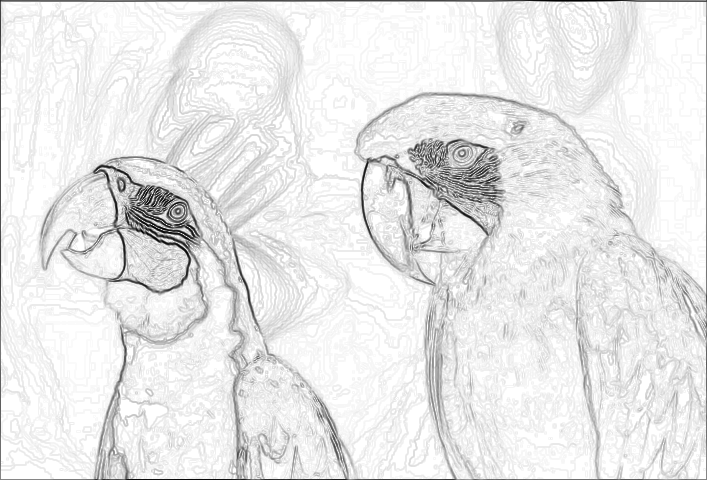

# CS203B Project: Intelligent Scissors

组员：庄子鲲（12110418），张志毅（12111916），高艺萌（12112804）

---

**本项目基于 Java（JDK 17）开发了一款智能抠图工具，具备以下核心功能：**

1. **智能边缘识别：** 用户指定起始点和终止点后，程序可自动追踪并寻找物体的边缘路径，过程支持动态可视化，便于用户实时调整。
2. **边缘吸附功能：** 鼠标在目标轮廓附近移动时，程序可自动将裁剪路径吸附至图像显著边缘，无需用户精确描绘，提升抠图效率与体验。
3. **路径冷却机制：** 当用户操作稳定且路径收敛时，系统会自动锁定当前裁剪路径，避免路径频繁波动，确保操作流畅性。
4. **操作撤销功能：** 用户可以点击右键实现撤销功能。
5. **图像抠图与保存：** 支持将最终圈选区域从原图中抠出，并提供图像保存功能，方便用户导出处理结果。

**项目文件已包含全部必要源代码，运行测试时直接执行 `Main.java` 即可启动程序。**

在实现原理上，项目主要由以下三部分组成：

- **代价图生成：** 基于图像梯度等特征构建代价图，为路径搜索提供权重参考；
- **最短路径搜索算法：** 使用基于 Dijkstra 的图搜索算法，从用户指定起点动态计算最优边缘路径；
- **图形用户界面（GUI）：** 提供交互式操作界面，实现图像加载、路径选择、边缘吸附和结果可视化等功能。

---

## 代价图生成

将用户指定的图像转换为可供后续处理的代价图，主要包含代价矩阵生成和代价图生成两个部分。

### 代价矩阵生成

读取图片后，使用 Sobel 算子对图片进行 $3\times 3$ 的邻域卷积操作，计算图片中每个像素的梯度。Sobel 算子如下：
$$
S_x = \begin{bmatrix}-1&0&1\\-2&0&2\\-1&0&1 \end{bmatrix}
$$

$$
S_y = \begin{bmatrix}-1&-2&-1\\0&0&0\\1&2&1 \end{bmatrix}
$$

其中 $S_x$ 用于水平方向的梯度计算，$S_y$ 用于垂直方向的梯度计算。

对于每个像素，分别对 $R, G, B$ 三个颜色通道进行独立的梯度计算，求取每个颜色通道的梯度值：
$$
G_i = \sqrt{I_{ix}^2+I_{iy}^2},\quad i=R,G,B
$$
每个像素最终的梯度值 $G$ 由 $G_i$ 的幅值计算得出：
$$
G = \sqrt{\sum_{i\in\{R,G,B\}}G_i^2}
$$
随后将每个像素的梯度值 $G$ 存储在二维数组 `double[][] gradientMatrix` 中，`gradientMatrix` 的第一维和第二维形状分别为图片的宽度 `width` 和高度 `height`。

之后对 `gradientMatrix` 进行归一化操作，将每个像素的梯度值限制在 $[0,1]$ 范围内，并且转换为代价 $f_G$：
$$
f_G = 1-\frac{G-G_{\min}}{G_{\max}-G_{\min}}
$$
将每个像素点的代价 $f_G$ 存入二维数组 `double[][] costMatrix` 中，`costMatrix` 形状和 `gradientMatrix` 相同。

将代价矩阵可视化，可以发现图片的边缘清晰呈现。

### 代价图生成

代价图采用”邻链表“方式构造，将每个像素点作为图的节点 `PixelNode` (包含两个属性，分别是横坐标 $x$ 和纵坐标 $y$，均与图片像素点的位置对应），每个节点的邻居节点都以链表方式储存，形成 `ArrayList<Neighbor> neighbors`。`Neighbor` 类中包含邻居节点和当前节点与该邻居节点的边 (link) 值。

每条边的值由以下公式得到：
$$
\text{link}(x,y) = f_G(x) +f_G(y)
$$
综上，可以将代价矩阵转为代价图，最终将代价图扁平化，存储在 HashMap 中，key 为像素坐标 `(i,j)`，value 为该坐标对应的图节点 `node[i][j]`。

## 最短路径搜索算法 

首先来看一下基本的Dijkstra寻路算法的流程。如下所示：

### 输入输出  
| 类别 | 元素 |  
|-------|------|  
| 输入 | 种子像素 `s`，邻接像素链路成本函数 `l(q,r)` |  
| 输出 | 各像素指向最小成本路径的指针数组 `p(q)` |  

### 关键数据结构  
- **活动列表 L**​：优先队列（按总成本 `g(q)` 排序）  
- **邻域 N(q)​**​：8邻域像素集合  
- **标记 e(q)​**​：标识像素是否已处理  
- **总成本 g(q)​**​：种子点 `s` 到 `q` 的累积成本  

### 算法流程  
1. 初始化种子点 `g(s)=0`  
2. **循环处理活动列表**​：  
   - 取出最小成本像素 `q`  
   - 遍历其未处理的8邻域像素 `r`  
   - 计算新成本 `g_tmp = g(q) + l(q,r)`  
   - **松弛操作**​：若新成本更低，更新 `g(r)` 并记录路径指针 `p(r)=q`  
   - 将 `r` 加入活动列表  

但是上面这个算法还不够完美，在这个算法的基础上我们进行了两点改进:

① 对于对角线上的邻域像素，我们对其代价做乘以$\sqrt{2}$ 的操作，这样从方向来讲，从四个扩展到八个，能够更加契合边缘。

② 增加了稳定性检测，如果 总代价/路径长度 < 1.6 && 长度>50 ，则我们认为这个线路是稳定的，这个操作是为了bonus2做准备。

##  抠图实现
抠图的基本原理是基于封闭轮廓内外区域的分离。程序首先通过用户绘制的路径（边界）创建一个二值掩码图像，其中边界上的点标记为白色，其余区域为黑色。然后通过洪水填充算法（Flood Fill）从封闭区域内的种子点开始，逐步扩散并标记所有在边界内的像素点，生成一个完整的二值掩码矩阵。最后应用这个掩码到原图上，仅保留掩码区域内（值为true）的像素，将掩码外的像素设为透明（alpha=0），从而实现前景与背景的分离，完成抠图操作。同时我们设置了终点检测，检测其与起点的位置关系，如果比较靠近并且图形封闭，则会自动抠图。效果如下所示：

## bonus1

以鼠标为中心，半径为9像素的正方形范围内寻找梯度最大的点作为吸附点，即代价矩阵 `costMatrix` 中值最小的点。通过简单的遍历操作实现。**吸附点以黄色高亮圆圈画出。**

从图中可以看出黄色点为吸附点，已经跟鼠标中心有一段距离，证明可以正确吸附到最近的边缘位置。

## bonus2 

### 基本原理

稳定性检测是一种自动锚点确定机制，用于提高智能抠图的效率。当系统检测到沿着图像边缘的路径达到足够稳定状态时，会自动将当前鼠标位置设为新的固定点，无需用户手动点击确认。

### 稳定性判断标准

稳定性判断主要基于两个关键标准：

1. **路径平均代价评估**：
   - 计算公式：`总代价/路径长度 < 1.6`
   - 低平均代价表示路径紧密贴合图像边缘
   - 阈值1.6是通过实验确定的最佳值

2. **路径长度判断**：
   - 要求：`路径长度 > 50`个像素点
   - 确保路径足够长，避免短暂路径的误判
   - 较长路径能更好地体现用户的实际轮廓追踪意图

### 工作流程

1. 使用Dijkstra算法计算从上一个固定点到当前鼠标位置的最优路径
2. 对计算得到的路径进行稳定性评估（平均代价和长度）
3. 当路径满足稳定条件时，系统会：
   - 将`stabled`标志设为`true`
   - 自动将当前点作为新的种子点固定下来
   - 将固定的路径以红色高亮显示
   - 开始计算从新固定点出发的下一段路径

### 优势

1. **提升效率**：用户只需沿着目标轮廓移动鼠标，无需频繁点击
2. **更加流畅**：避免了手动点击造成的操作中断
3. **边缘精确度高**：系统会自动选择代价最小的路径，更贴合实际边缘
4. **操作简化**：用户只需关注大致轮廓方向，无需精确定位边缘点

这种机制特别适合于边缘明显的图像，通过减少用户操作次数，显著提高了抠图效率和体验。
## GUI实现

GUI通过JAVA提供的swing库实现用户交互。运行本程序时首先会弹出文件选择框，默认为当前项目所在文件夹，在找到需要框选的图片文件后打开，会进入程序主界面。程序主界面分为两部分。上半部分为图片框选区域，下半部分为按钮区。

### 图片框选区域使用方法：

当鼠标移到图片框选区域时会自动变成十字，以便选择到对应的图片像素。

点击左键之后会自动选上第一个点，此时可以开始沿着图像边缘移动光标进行选择。此时会根据光标移动的位置自动计算最优路径，同时根据bonus1的要求可以在光标周围找到最优的路径点并将裁剪路径吸附在显著边缘上。

在满足一定条件被判断为操作稳定且路径收敛时，本程序会自动锁定当前裁剪路径并将此条路径颜色设置成红色，即不会被改变的路径，也可以通过鼠标左键点击手动强制锁定当前裁剪路径。

在路径闭合时，程序会自动抠出闭合的图像并展示，同时弹出对话框询问用户是否保存。若用户保存则跳出文件选择框输入好路径之后进行保存。若用户不保存则会清空当前路径还原图片重新开始。

### 按钮区域使用方法：

按钮区域包含两个按钮，分别为重置点和打开文件。

当按下重置点按钮，图片框选区将会清除所有裁剪路径线条以及清除框选起点信息，此时可以重新进行图片裁剪路径的选择操作。

当按下打开文件按钮后，会弹出对话框提示选择图片文件并打开，替换掉当前图片框选区的图片并删除所有之前图片的裁剪路径线条进行重置。

